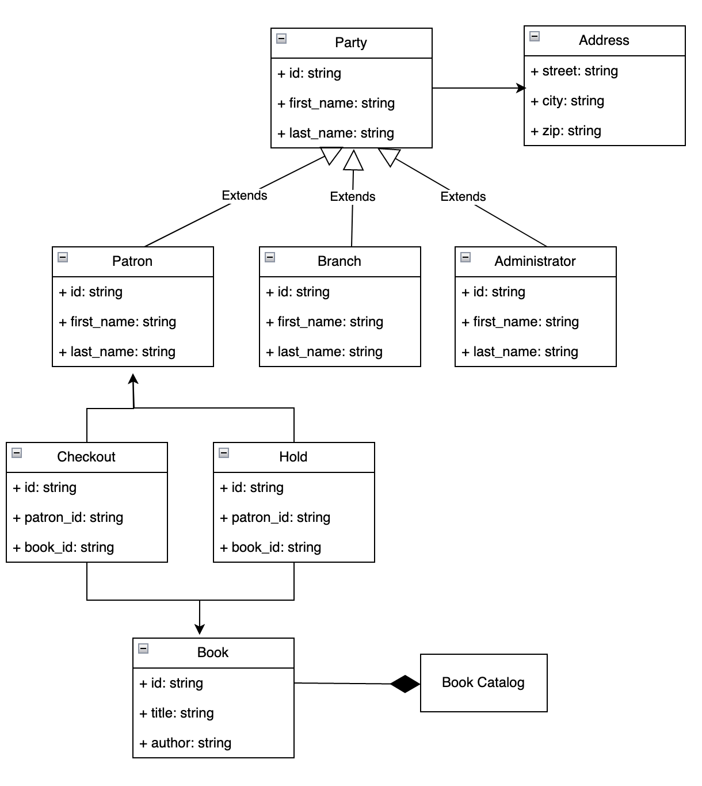
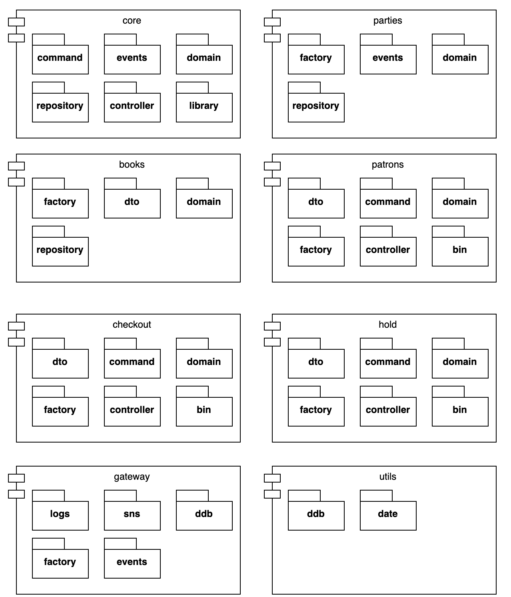

# Sample Domain-Driven Application

## A sample Library Management System Services
View [lms/README.md](lms/README.md)

## Infrastructure as code using CDK for the sample-app
View [cdk/README.md](cdk/README.md)

## Sample User-Stories
- As a library administrator, I want to add a book to the collection so that patrons of the library may checkout it.
- As a library administrator, I want to remove a book from the collection so that it's no longer available to borrow.
- As a library administrator or a patron, I want to search books based on different criteria such as title, author, publisher, dates, etc. so that I may see details or use it to checkout the book later.
- As a patron, I want to checkout a book so that I can raed it and return later.
- As a patron, I want to return a checked out book when I am done with reading.
- As a patron, I want to hold a book, which is not currently available so that I can checkout later.
- As a patron, I want to cancel the hold that previously made when I am no longer interested in the book. 
- As a patron, I want to checkout the book hold that previously made so that I can read it.

In addition, the library may impose certain policies and restrictions on the books and checkout/hold actions such as restricted book can be held by a researcher patron or limit the
number of books that can be held or checkout at a time.

## Domain Model
Following domain model was defined as a result of above use-stories and an [event-storming](https://www.eventstorming.com/) exercise:



### Party Pattern
Above design uses [party-pattern](https://www.martinfowler.com/apsupp/accountability.pdf) to model patrons, library administrator and library branches as they can share a lot of common
attributes to describe people and organizations. The base Party class uses Address class to store physical address, so the Party class acts as an Aggregate for all related data about people
and organizations.

### Book
The book class abstracts a library book that can be added to the library collection, queried by the administrators or patrons and then checkout or hold by the patrons. 

### Checkout
The Checkout class abstracts the data when checking out a book, which can be returned later.

### Hold
The Hold class abstracts the data when holding a book that is not currently available so that it can be checkout later.

## Components and Modules
Using above domain model, the library management application was divided into following modules:



### core module
The core module abstracts common domain model, domain events and interfaces for command pattern, repository and controllers.

### parties module
The parties module defines domain model for the party class and data access methods for persisting and querying parties (people and organizations).

### books module
The books module defines domain model and data transfer model for books as well as repository for persisting and querying books using AWS DynamoDB.

### patrons module
The patron module builts upon the parties module and defines service sub-module for business logic to query and perssit patrons. The patron module also includes controller, 
command classes and binary/main module to define microservices based on AWS Lambda.

### checkout module
The checkout module implements services for checking out and returning book, which are then made available as microservices using controller, command and binary sub-modules.

### hold module
The hold module implements services for holding a book or canceling/returning it later, which are then made available as microservices using controller, command and binary sub-modules.

### gateway module
The gateway module defines interfaces to connect to external services such as AWS CloudWatch and AWS SNS. The AWS SNS is used to publish events from the domain changes. 

## Aggregates and Event Stream
Above modules and domain model with each other using event streams, which is built upon AWS SNS service underneath, e.g.
```rust
    async fn checkout(&self, patron_id: &str, book_id: &str) -> LibraryResult<CheckoutDto> {
        let patron = self.patron_service.find_patron_by_id(patron_id).await?;
        let book = self.catalog_service.find_book_by_id(book_id).await?;
        if book.status() != BookStatus::Available {
            return Err(LibraryError::validation(format!("book is not available {}",
                                                        book.id()).as_str(), Some("400".to_string())));
        }
        if book.is_restricted() && patron.is_regular() {
            return Err(LibraryError::validation(format!("patron {} cannot hold restricted books {}",
                                                        patron.id(), book.id()).as_str(), Some("400".to_string())));
        }
        let checkout = CheckoutDto::from_patron_book(self.branch_id.as_str(), &patron, &book);
        self.checkout_repository.create(&CheckoutEntity::from(&checkout)).await?;
        let _ = self.events_publisher.publish(&DomainEvent::added(
            "book_checkout", "checkout", checkout.checkout_id.as_str(), &HashMap::new(), &checkout.clone())?).await?;
        Ok(checkout)
    }
```

The `events_publisher` publishes the domain events upon checking out a book. Similar events are published for other user-actions or domain changes.

### Data Transfer Objects
The sample application uses immutable data transfer objects when invoking a business service, a command or a method on controller so that these objects are free of side effects and
can be safely shared with other modules in concurrent environment.

### Repository Pattern
The sample application uses repository pattern to persist or query data, which can be implemented based on any supported implementation (such as DynamoDB).

### Monads and Errors
The sample application uses `Result` monad for returning results from a service, command or controller so that caller can handle errors properly. In addition, `Option` monad
is used for defining any optional data properties so that the compiler can enforce all type checking.

## Tree structure
Following tree structure shows the module and code structure:

├── books
│   ├── domain
│   │   └── model.rs
│   ├── domain.rs
│   ├── dto.rs
│   ├── factory.rs
│   ├── repository
│   │   └── ddb_book_repository.rs
│   └── repository.rs
├── books.rs
├── catalog
│   ├── bin
│   │   └── main.rs
│   ├── command
│   │   ├── add_book_cmd.rs
│   │   ├── get_book_cmd.rs
│   │   ├── remove_book_cmd.rs
│   │   └── update_book_cmd.rs
│   ├── command.rs
│   ├── controller.rs
│   ├── domain
│   │   └── service.rs
│   ├── domain.rs
│   ├── dto.rs
│   └── factory.rs
├── catalog.rs
├── checkout
│   ├── bin
│   │   └── main.rs
│   ├── command
│   │   ├── checkout_book_cmd.rs
│   │   └── return_book_cmd.rs
│   ├── command.rs
│   ├── controller.rs
│   ├── domain
│   │   ├── model.rs
│   │   └── service.rs
│   ├── domain.rs
│   ├── dto.rs
│   ├── factory.rs
│   ├── repository
│   │   └── ddb_checkout_repository.rs
│   └── repository.rs
├── checkout.rs
├── core
│   ├── command.rs
│   ├── controller.rs
│   ├── domain.rs
│   ├── events.rs
│   ├── library.rs
│   └── repository.rs
├── core.rs
├── gateway
│   ├── ddb
│   │   └── publisher.rs
│   ├── ddb.rs
│   ├── events.rs
│   ├── factory.rs
│   ├── logs.rs
│   ├── sns
│   │   └── publisher.rs
│   └── sns.rs
├── gateway.rs
├── hold
│   ├── bin
│   │   └── main.rs
│   ├── command
│   │   ├── cancel_hold_book_cmd.rs
│   │   ├── checkout_hold_book_cmd.rs
│   │   └── hold_book_cmd.rs
│   ├── command.rs
│   ├── controller.rs
│   ├── domain
│   │   ├── model.rs
│   │   └── service.rs
│   ├── domain.rs
│   ├── dto.rs
│   ├── events.rs
│   ├── factory.rs
│   ├── repository
│   │   └── ddb_hold_repository.rs
│   └── repository.rs
├── hold.rs
├── lib.rs
├── library.rs
├── main.rs
├── parties
│   ├── domain
│   │   └── model.rs
│   ├── domain.rs
│   ├── events.rs
│   ├── factory.rs
│   ├── repository
│   │   └── ddb_party_repository.rs
│   └── repository.rs
├── parties.rs
├── patrons
│   ├── bin
│   │   └── main.rs
│   ├── command
│   │   ├── add_patron_cmd.rs
│   │   ├── get_patron_cmd.rs
│   │   ├── remove_patron_cmd.rs
│   │   └── update_patron_cmd.rs
│   ├── command.rs
│   ├── controller.rs
│   ├── domain
│   │   └── service.rs
│   ├── domain.rs
│   ├── dto.rs
│   └── factory.rs
├── patrons.rs
├── utils
│   ├── date.rs
│   └── ddb.rs
└── utils.rs

## Building and Testing
See [lms/README.md](lms/README.md) for instructions on building and testing the sample application.

